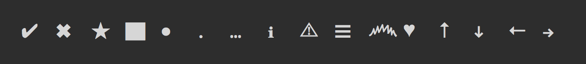

# figures [](https://travis-ci.org/sindresorhus/figures)

> Unicode symbols with Windows CMD fallbacks

[](index.js)

[*and more...*](index.js)

Windows CMD only supports a [limited character set](http://en.wikipedia.org/wiki/Code_page_437).


## Install

```
$ npm install --save figures
```


## Usage

See the [source](index.js) for supported symbols.

```js
const figures = require('figures');

console.log(figures('✔︎ check'));
// On real OSes:  ✔︎ check
// On Windows:    √ check

console.log(figures.tick);
// On real OSes:  ✔︎
// On Windows:    √
```


## API

### figures(input)

Returns the input with replaced fallback unicode symbols on Windows.

#### input

Type: `string`

String where the unicode symbols will be replaced with fallback symbols depending on the OS.


## License

MIT © [Sindre Sorhus](https://sindresorhus.com)
